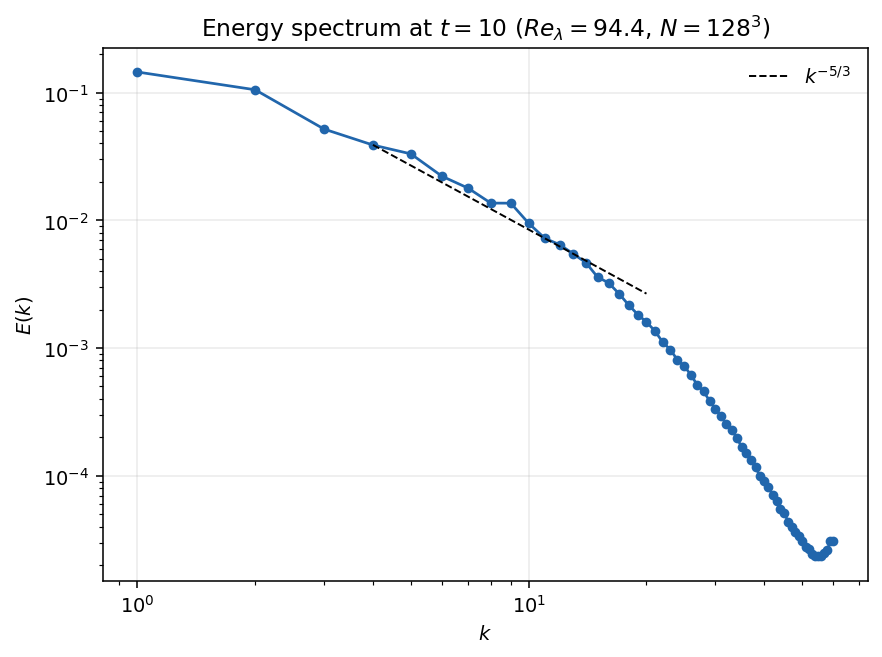
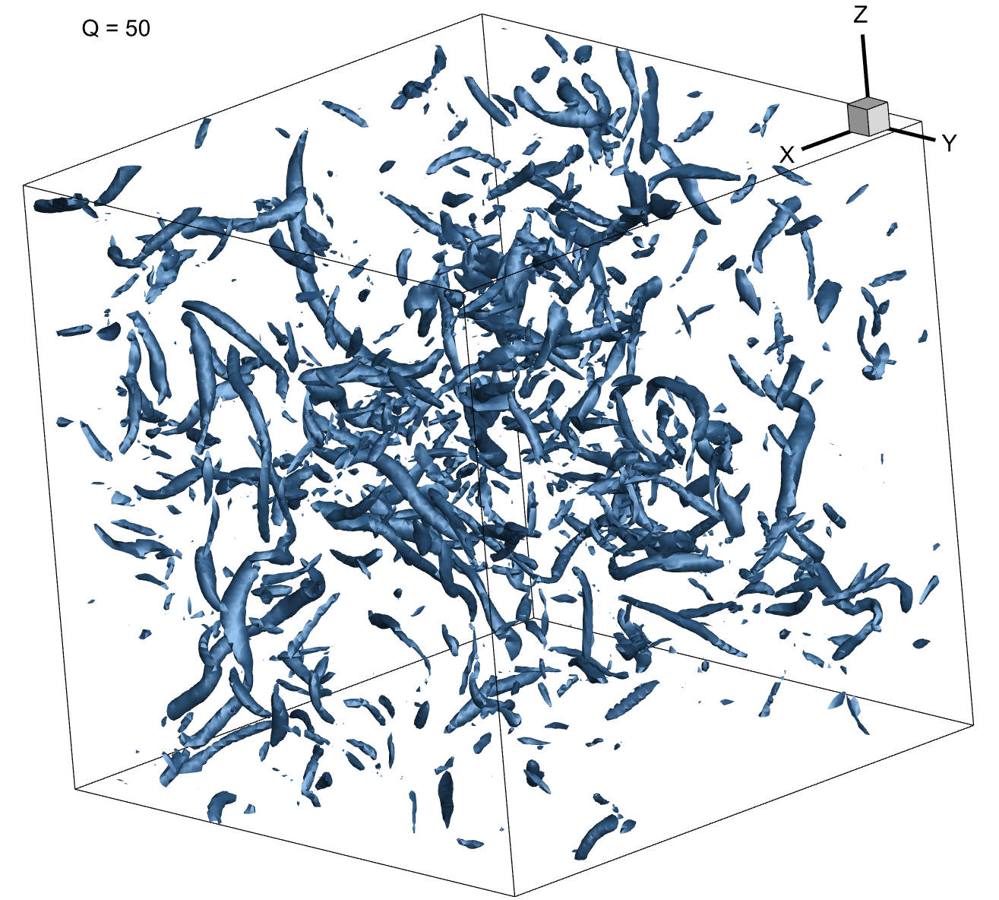

# SpectralDNS-GPU

A PyTorch pseudospectral solver for three-dimensional incompressible homogeneous isotropic turbulence in a periodic \((2\pi)^3\) domain. The solver supports RK2/RK4 time integration, forced turbulence, GPU acceleration, and `2/3`, `3/2`, or phase-shift dealiasing.

## Requirements

- Python 3.10+
- PyTorch
- NumPy
- Matplotlib (only needed for plotting)

Install PyTorch using the command recommended for your CUDA version at [pytorch.org](https://pytorch.org/get-started/locally/), then install the remaining packages:

```bash
pip install numpy matplotlib
```

## Run a simulation

1. In `main.py`, select a configuration from `configs/`.
2. Set `rule = 'sim'`.
3. From this directory, run:

```bash
python main.py
```

The main parameters are defined in each configuration file: grid size `N`, viscosity `nu`, time step `dt`, total time `Ttotal`, time scheme, dealiasing method, output frequency, and output directory. CUDA is used when it is available; otherwise the solver falls back to CPU.

Simulation snapshots (`YZXDNS-*.npz`), history files, and the latest Tecplot field are written to `savefolder`.

## Post-process saved data

Set `rule = 'post'` in `main.py`, make sure `savefolder_std` (or `savefolder`) points to the directory containing the saved snapshots, and run `python main.py` again. Statistical results are saved as `Statistic_*.json`.

## Re_lambda = 100 case at T = 10

`main.py` is configured to run the forced `N=128`, `nu=0.002`, `dt=0.001`
case through `T=10` with a fixed random seed. Only the final velocity field is
retained as the observation snapshot. Generate the final energy-spectrum plot with:

```bash
python plot_final_observation.py
```

Final-snapshot diagnostics (the case has nominal `Re_lambda = 100`):

| Quantity | Value |
| --- | ---: |
| Time | 10.0 |
| Kinetic energy | 0.500000 |
| Dissipation rate | 0.0935133 |
| Observed `Re_lambda` | 94.4001 |
| `k_max*eta` | 1.03195 |




